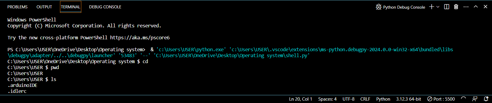
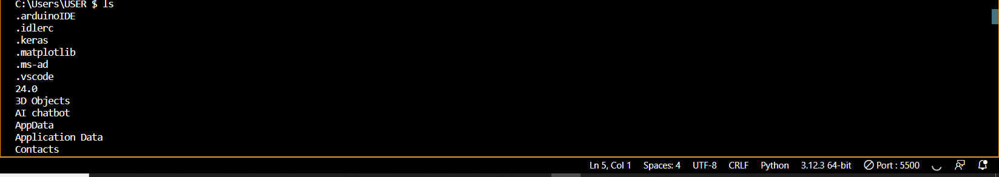
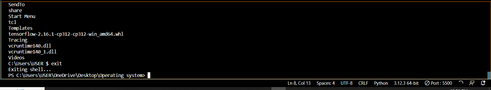

# Command-Line Shell
## 1. Introduction
This project aims to develop a simple command-line interface (CLI) shell in Python, providing basic functionalities akin to standard shells such as Bash. The shell can execute system commands, navigate the file system, and handle basic built-in commands, offering a foundational understanding of shell operations and command execution.
## 2. Objectives
The primary objectives of this project are:
•	To develop a basic command-line shell using Python.
•	To implement core functionalities such as command execution, file system navigation, and built-in commands.
•	To demonstrate proficiency in Python programming and understanding of shell operations.
## 3. Methodology
### 3.1 Technology Stack
•	Programming Language: Python 3.x
•	Libraries: os and subprocess for system-level operations
### 3.2 Project Workflow
1.	Design and Planning: Outline the required features and design the structure of the shell.
2.	Implementation: Write the code for command parsing, execution, and error handling.
3.	Testing: Validate the shell’s functionality with various commands and scenarios.
4.	Documentation: Document the project structure, usage, and code.
## 4. System Design
### 4.1 Project Structure
### simple_shell/
├── shell.py
├── commands.py
└── README.md
### 4.2 Command Execution Logic
The shell processes user inputs, parses commands, and executes them using system-level functions. Built-in commands are handled separately, while other commands are executed via the operating system.
## 5. Implementation
### 5.1 shell.py
This file serves as the entry point of the shell, managing the user input loop and invoking the command execution functions.
## Code(Shell.py)
import os
import sys
from commands import execute_command

def main():
    while True:
        try:
            current_directory = os.getcwd()
            command = input(f"{current_directory} $ ")
            if command.strip():
                execute_command(command.strip())
        except KeyboardInterrupt:
            print("\nUse 'exit' to quit the shell.")
        except EOFError:
            break

if __name__ == "__main__":
    main()
### 5.2 commands.py
This file contains the logic for executing commands, including built-in 
import os
import subprocess
import sys

def execute_command(command):
    parts = command.split()
    cmd = parts[0]
    args = parts[1:]

    if cmd == "exit":
        print("Exiting shell...")
        sys.exit(0)
    elif cmd == "cd":
        change_directory(args)
    elif cmd == "pwd":
        print(os.getcwd())
    elif cmd == "ls":
        list_directory(args)
    else:
        run_system_command(command)

def change_directory(args):
    if len(args) == 0:
        os.chdir(os.path.expanduser("~"))
    else:
        try:
            os.chdir(args[0])
        except FileNotFoundError:
            print(f"cd: no such file or directory: {args[0]}")

def list_directory(args):
    path = args[0] if len(args) > 0 else "."
    try:
        for entry in os.listdir(path):
            print(entry)
    except FileNotFoundError:
        print(f"ls: cannot access '{path}': No such file or directory")

def run_system_command(command):
    try:
        result = subprocess.run(command, shell=True, check=True, stdout=subprocess.PIPE, stderr=subprocess.PIPE)
        print(result.stdout.decode('utf-8'))
    except subprocess.CalledProcessError as e:
        print(e.stderr.decode('utf-8'))

## OUTPUT  OF DIFFERENT TYPES OF COMMANDS:

## 6. Testing and Validation
### 6.1 Test Cases
•	Navigation Commands:
o	cd [directory]: Change directory
o	pwd: Print current directory
•	File Operations:
o	ls [directory]: List directory contents
•	Built-in Commands:
o	exit: Quit the shell
### 6.2 Validation
Each feature is tested individually and in combination to ensure seamless functionality. Common error cases, such as non-existent directories or incorrect command syntax, are handled gracefully.
## 7. Conclusion
The Simple Command-Line Shell project demonstrates the development of a basic shell interface using Python. It covers essential shell functionalities, providing a practical understanding of command parsing, file system navigation, and command execution.
## 8. Future Enhancements
•	Advanced Features: Add functionalities like file copying, moving, and renaming.
•	Error Handling: Improve error messages for a better user experience.
•	Command History: Implement command history and auto-completion features.
## 9. References
•	Python Documentation: https://docs.python.org/3/
•	tkinter Documentation: https://docs.python.org/3/library/tkinter.html
•	os module Documentation: https://docs.python.org/3/library/os.html
•	YouTube: For video tutorials and demonstrations on Python CLI development.
•	Google: For general information and research on Python programming.
•	Stack Overflow: Community-driven platform for troubleshooting and finding solutions to programming queries.
•	ChatGPT: AI language model used for guidance and assistance in project development and problem-solving
